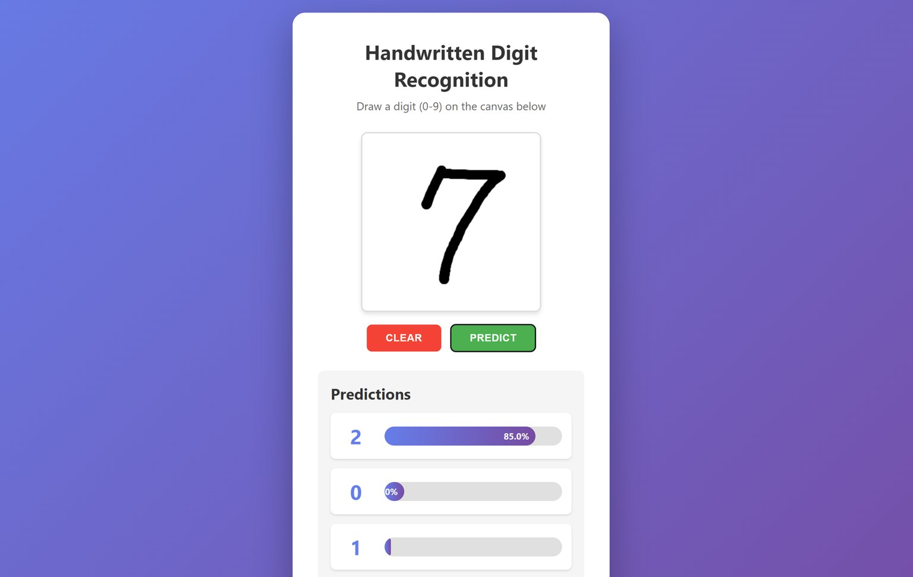
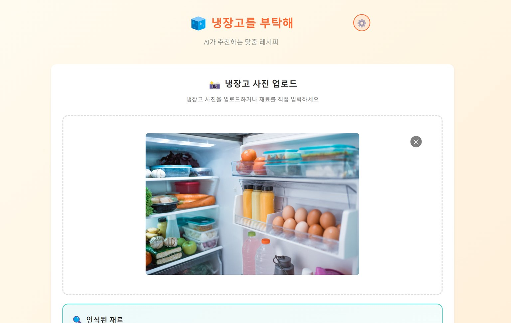
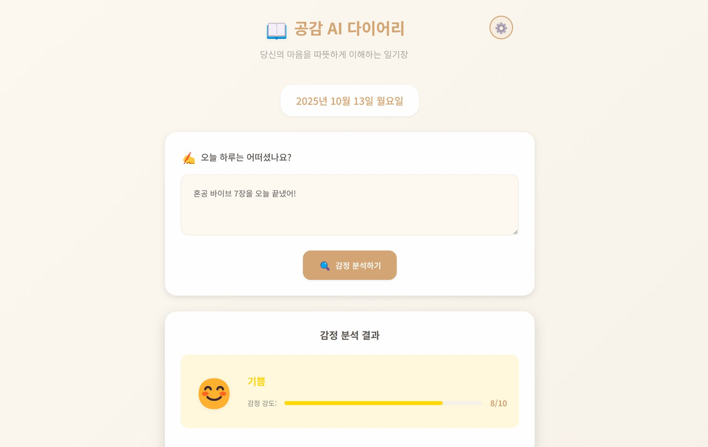
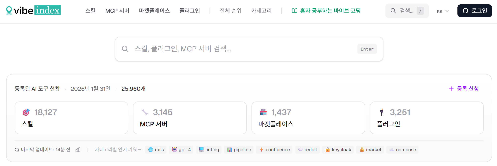
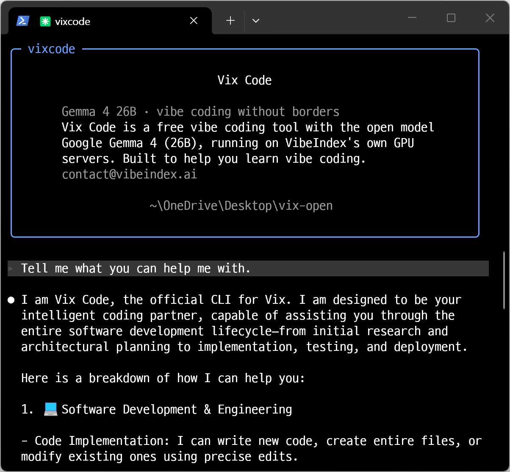

<h1 align="center">Claude Code in Action</h1>
<h3 align="center">From zero to deployed apps with AI-assisted development</h3>

  

  
Learn <strong>vibe coding</strong> — a new way of building software by talking with AI. 
  With Claude Code, you can build complete web applications using nothing but prompts.

---

  <h3>📱 Preview of the Hands-On Projects</h3>
  
<em>Click an image to launch the live demo</em>

  <table>
    <tr>
      <td align="center">
        
         
        <strong>Chapter 3: Handwritten Digit Recognition</strong>
      </td>
      <td align="center">
        
         
        <strong>Chapter 6: FridgeChef</strong>
      </td>
      <td align="center">
        
         
        <strong>Chapter 7: AI Empathy Diary</strong>
      </td>
    </tr>
  </table>

---

📝 **[View the complete prompt collection](PROMPTS.md)** — copy and paste the prompts as directed in the book.

---

## 📢 News

<em>Created for readers of this book.</em>

<table align="center">
<tr>
<td align="center" valign="top" width="600">

**All vibe coding resources in one place**

Skills, plugins, and MCP servers collected in real time, 
with summaries and category-based organization.

👉 **[Visit Vibe Index](https://www.vibeindex.ai/)**

</td>
</tr>
</table>

 

<table align="center">
<tr>
<td align="center" valign="top" width="600">

**A free vibe coding tool for learners**

Practice for free with the same interface as Claude Code. 
Direct file editing, terminal, and Git integration included.

👉 **[Try Vix Code](https://www.vibeindex.ai/vixcode)**

</td>
</tr>
</table>

---

## 📖 Table of Contents

**Chapter 1: My First Vibe Coding** [📝 Prompts](https://github.com/taehojo/vibecoding-eng/blob/main/PROMPTS.md#chapter-1-my-first-vibe-coding)
- 01-1 My Coding Partner, AI Assistant
  - Vibe coding
  - The emergence of AI integration tools
  - Deep dive: The birth and evolution of AI
- 01-2 Create My Own First Webpage
  - Getting started with Claude
  - Creating a web page with Claude Artifacts
  - Creating and publishing a web page
  - Adding your own touch with customization
  - Deep dive: Unlocking a more powerful AI partner with a Claude subscription

> **Example**: My first web page — a personal start homepage with today's date and time, and a search bar (built with Claude Artifacts)

**Chapter 2: Maximizing AI's Potential by 200% with Effective Prompts** [📝 Prompts](https://github.com/taehojo/vibecoding-eng/blob/main/PROMPTS.md#chapter-2-maximizing-ais-potential-by-200-with-effective-prompts)
- 02-1 The Secrets of Prompts That Awaken AI
  - The importance of prompts
  - Drafting a product proposal
- 02-2 Real-World Application: Completing Your Marketing Portfolio
  - The 4-step portfolio strategy
  - Step 1: Framework
  - Step 2: Features
  - Step 3: Design
  - Step 4: Review

> **Example**: Marketing portfolio website — a portfolio a recruiter can grasp in 30 seconds (hero-introduction, performance-metrics, and case-studies sections built step by step)

**Chapter 3: Getting Started with Claude Code** [📝 Prompts](https://github.com/taehojo/vibecoding-eng/blob/main/PROMPTS.md#chapter-3-getting-started-with-claude-code)
- 03-1 Installing Claude Code
  - Setting up the practice environment
  - Launching the terminal
  - Claude Code
- 03-2 Building a Handwriting Recognition Program
  - Preparing the project folder
  - Creating a number recognition program with the MNIST dataset
- 03-3 Expanding the Program with CLAUDE.md
  - Understanding project configuration files
  - Creating a web version handwriting recognition program using a hierarchical structure

> **Example**: Handwriting recognition program [🎯 Live demo](https://vibecoding-eng-ch03.vercel.app) — a digit recognition desktop app built on the MNIST dataset, extended to a web version (using a hierarchical folder structure)

**Chapter 4: Practical Use of Claude Code** [📝 Prompts](https://github.com/taehojo/vibecoding-eng/blob/main/PROMPTS.md#chapter-4-practical-use-of-claude-code)
- 04-1 Learning Claude Code Commands with Step-by-Step Prompts
  - Writing step-by-step prompts
  - Executing step-by-step prompts
  - Claude initial setup commands
- 04-2 Resuming Work and Increasing Efficiency
  - Adding features
  - Boosting work efficiency with Auto-Approve mode
  - Managing context
- 04-3 Project Improvement and Task Management
  - Improving the desktop version app's UI with a capture image
  - Quickly reviewing code using references
  - Managing Claude Code projects

> **Example**: Todo app [🎯 Live demo](https://vibecoding-eng-ch04.vercel.app) — add/edit/delete tasks, category tags, progress dashboard, dark mode (mobile-style and desktop-optimized layouts)

**Chapter 5: Systematic Development and Management Through Game Building** [📝 Prompts](https://github.com/taehojo/vibecoding-eng/blob/main/PROMPTS.md#chapter-5-systematic-development-and-management-through-game-building)
- 05-1 Creating AI Content Without Hallucinations
  - Step 1: Implementing the quiz game [📥 Download](https://download-directory.github.io/?url=https://github.com/taehojo/vibecoding-eng/tree/main/Study-03/Study-03-basic)
  - Fixing hallucinations
- 05-2 Boosting Development Efficiency with Automation
  - Step 2: Extending the game
  - Automating repetitive tasks with custom commands
  - Extending custom commands
  - Automating new quiz question creation
- 05-3 Selective Update Strategies Through Command Chaining
  - Step 3: Data persistence and a ranking system
  - Automating the game development workflow
  - Custom commands Claude Code creates on its own
  - Building an efficient maintenance workflow

> **Example**: Trivia quiz game [🎯 Live demo](https://vibecoding-eng-ch05.vercel.app) — four-option multiple choice, category modes, scoring system, leaderboard (with hallucination verification guidelines and custom command automation)

**Chapter 6: Giving Claude Code Wings with APIs** [📝 Prompts](https://github.com/taehojo/vibecoding-eng/blob/main/PROMPTS.md#chapter-6-giving-claude-code-wings-with-apis)
- 06-1 Setting Up APIs in Claude Code
  - API concepts and how to use them
  - Choosing an AI model
  - Connecting and testing an AI model
- 06-2 Building "FridgeChef" with Claude Code and an API
  - Writing a PRD for the application
  - Step 1: Recognizing ingredients from a fridge photo
  - Step 2: Generating recipes
  - Step 3: Saving recipes to a user profile

> **Example**: FridgeChef app [🎯 Live demo](https://vibecoding-eng-ch06.vercel.app) — upload a fridge photo ([📥 sample input](https://raw.githubusercontent.com/taehojo/vibecoding-eng/main/input-examples/fridge2.jpg)) → ingredient recognition → recipe recommendations → user profile/save feature (built in 3 steps)

**Chapter 7: Building a Development Team with Claude Code AI Agents** [📝 Prompts](https://github.com/taehojo/vibecoding-eng/blob/main/PROMPTS.md#chapter-7-building-a-development-team-with-claude-code-ai-agents)
- 07-1 Understanding Claude Code AI Agents
  - My first agent: a code reviewer
  - An optimization agent
  - A UX design agent
  - Testing subagent collaboration
  - Backing up your work
- 07-2 Automating Software Development with AI Agents
  - Building your own AI development team
  - An app completed by your agent team: "AI Empathy Diary"
  - An app completed by your agent team: "PDF Summarizer AI"

> **Examples**:
> - AI Empathy Diary app [🎯 Live demo](https://vibecoding-eng-ch07.vercel.app): write one line about your day → emotion analysis → empathetic message (agent collaboration: backend, frontend, QA)
> - PDF Summarizer AI [🎯 Live demo](https://vibecoding-eng-ch07.vercel.app/pdf): upload a PDF ([📥 sample input](https://raw.githubusercontent.com/taehojo/vibecoding-eng/main/input-examples/korean-spelling.pdf) — a sample PDF document in Korean) → text extraction → summary/analysis (5-agent collaboration: planning, backend, AI integration, frontend, QA)

**Chapter 8: Going Beyond Claude Code's Limits with MCP** [📝 Prompts](https://github.com/taehojo/vibecoding-eng/blob/main/PROMPTS.md#chapter-8-going-beyond-claude-codes-limits-with-mcp)
- 08-1 Understanding MCP and Connecting It to Claude Code
  - The unlimited AI extensibility MCP unlocks
  - Connecting Claude Code to Notion
  - Making AI smarter with the Sequential Thinking MCP
  - Verifying the Sequential Thinking MCP's performance
- 08-2 A Fully Automated Development Environment with MCP
  - How to find the MCP servers you need
  - Building a shopping list app and automating tests with MCP
  - Archiving your project with the GitHub MCP
- 08-3 Connecting a Database to Build a Real Service
  - Deploying your own web page
  - Connecting the application to a database
  - Upgrading the shopping list app into a real service

> **Example**: Shopping list app [🎯 Live demo](https://vibecoding-eng-ch08.vercel.app) — Playwright automated testing → GitHub upload → Vercel deployment → Supabase database integration for a production-ready service

---

## 📦 Project Folders

The hands-on projects for each chapter are stored in the following folders.

| Chapter | Folder | Project | Link |
|:---:|:---:|:---|:---:|
| 3 | `Study-01` | Handwriting recognition program | [🎯 Live demo](https://vibecoding-eng-ch03.vercel.app) |
| 4 | `Study-02` | Todo app | [🎯 Live demo](https://vibecoding-eng-ch04.vercel.app) |
| 5 | `Study-03-basic` | Trivia quiz game (basic) | [📥 Download](https://download-directory.github.io/?url=https://github.com/taehojo/vibecoding-eng/tree/main/Study-03/Study-03-basic) |
| 5 | `Study-03-advanced` | Trivia quiz game (advanced) | [🎯 Live demo](https://vibecoding-eng-ch05.vercel.app) |
| 6 | `Study-04` | FridgeChef (AI recipe recommendations) | [🎯 Live demo](https://vibecoding-eng-ch06.vercel.app) |
| 7 | `Study-05` | AI Empathy Diary | [🎯 Live demo](https://vibecoding-eng-ch07.vercel.app) |
| 7 | `Study-05` | PDF Summarizer AI | [🎯 Live demo](https://vibecoding-eng-ch07.vercel.app/pdf) |
| 8 | `Study-06` | Shopping list app (database integration) | [🎯 Live demo](https://vibecoding-eng-ch08.vercel.app) |
